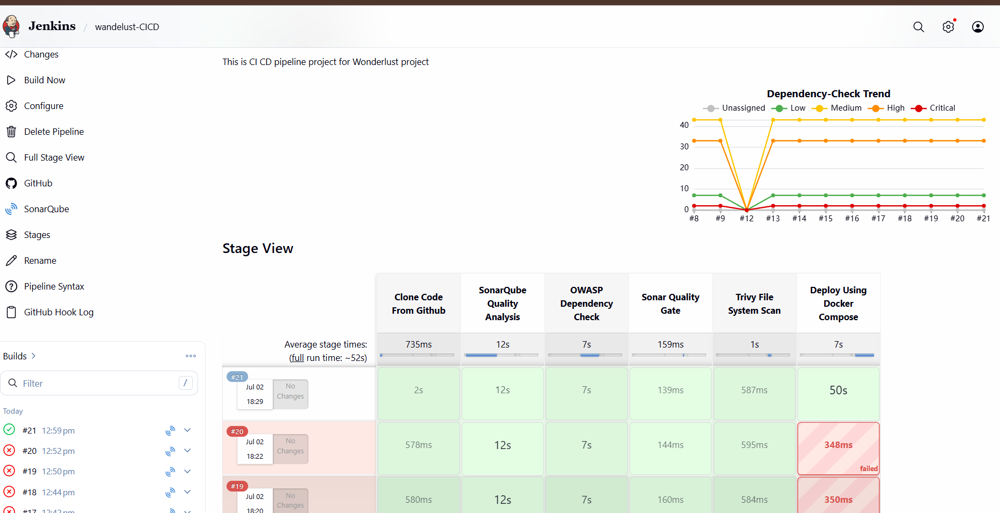
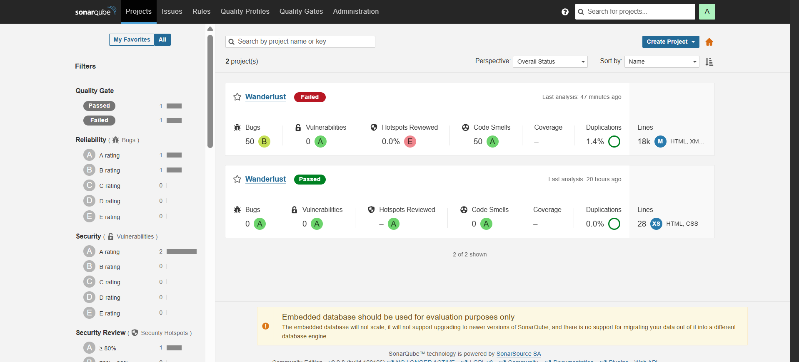

# 🚀 Wanderlust DevSecOps CI/CD Pipeline

> End-to-End DevSecOps CI/CD Pipeline for a MERN Stack Application using Jenkins, SonarQube, OWASP Dependency Check, Trivy, Docker, Docker Compose, MongoDB, Redis and AWS EC2.

---

# 📌 Project Overview

This project demonstrates an end-to-end DevSecOps pipeline for deploying the Wanderlust MERN Stack application.

The pipeline automates the complete software delivery lifecycle:

- Source Code Checkout
- Static Code Analysis
- Dependency Vulnerability Scan
- Quality Gate Validation
- File System Security Scan
- Docker Image Build
- Docker Compose Deployment

---

# ⚙️ Tech Stack

| Category | Technology |
|-----------|------------|
| Source Code | GitHub |
| CI/CD | Jenkins |
| Code Analysis | SonarQube |
| Dependency Scan | OWASP Dependency Check |
| Vulnerability Scan | Trivy |
| Containerization | Docker |
| Orchestration | Docker Compose |
| Database | MongoDB |
| Cache | Redis |
| Cloud | AWS EC2 |
| Frontend | React (Vite) |
| Backend | Node.js |

---

# 🔄 CI/CD Pipeline Workflow

```
GitHub
   │
   ▼
Clone Repository
   │
   ▼
SonarQube Analysis
   │
   ▼
OWASP Dependency Check
   │
   ▼
Quality Gate
   │
   ▼
Trivy File System Scan
   │
   ▼
Docker Build
   │
   ▼
Docker Compose Deployment
   │
   ▼
Application Deployment
```

---

# 📷 Jenkins Pipeline

<p align="center">
  
</p>

---

# 📊 SonarQube Dashboard

The project uses SonarQube for:

- Static Code Analysis
- Bug Detection
- Code Smells
- Security Vulnerability Detection
- Quality Gate Validation

<p align="center">
  
</p>

---

# 🔒 Security Scanning

### ✅ SonarQube

- Static Code Analysis
- Bugs Detection
- Code Smells Detection
- Security Vulnerabilities
- Quality Gate Validation

### ✅ OWASP Dependency Check

- Dependency Vulnerability Scan
- CVE Detection
- HTML & XML Report Generation

### ✅ Trivy

- File System Scan
- Vulnerability Detection
- Secret Detection
- Misconfiguration Detection

---

# 🐳 Docker Deployment

The application is deployed using Docker Compose.

Containers:

- Frontend
- Backend
- MongoDB
- Redis

```bash
docker compose up -d --build
```

---

# ☁️ AWS Deployment

The complete application is hosted on an AWS EC2 Instance.

Services running:

- Jenkins
- SonarQube
- Docker
- Docker Compose
- MongoDB
- Redis

---

# 📂 Repository Structure

```
.
├── backend/
├── frontend/
├── docker-compose.yml
├── README.MD
├── pipeline.png
└── Sonar.png
```

---

# 🚀 Future Improvements

- Kubernetes Deployment
- Helm Charts
- Prometheus Monitoring
- Grafana Dashboard
- ArgoCD
- Email Notifications

---

# 👨‍💻 Author

## Neeraj Kumar Verma

**Linux | DevOps | Cloud Engineer**


🌐 Portfolio: https://www.neerajverma.space

---

⭐ If you found this project useful, please consider giving it a Star.
